# 秀杰智联物联平台JieIOT

### 系统介绍
JieIOT是物联网平台是一款功能强大、安全可靠的物联网基础平台，可助力，帮助企业在极短的时间内搭建个性化的物联网平台和应用，实现数字化转型。平台支持多种通信协议，可灵活接入不同类型设备；提供实时数据采集、分析和处理能力，帮助企业挖掘数据价值；支持设备远程控制、监控和运维，降低运维成本，提升运维效率；此外，还支持物模型定义、可视化大屏、流媒体服务、开放API等功能，可广泛应用于智慧城市、智慧农业、工业制造、能源管理等多个领域。

平台向上对外开放功能完善的北向应用接口，支持第三方系统利用这些接口对接物联网平台，实现对设备的监控管理、远程控制等功能。平台预集成了规则引擎、可视化大屏、流媒体等核心服务，具有快速业务组装和交付的能力。 平台还提供了场景联动、设备远程控制、OTA固件升级等功能组件。平台具有高扩展性和开放性，可以方便地对接外部系统。

JieIOT具有完整的物联网平台关键能力覆盖，是一个功能强大、稳定可靠的企业级IoT平台解决方案。

### 适合用户
- 快速交付项目
- 快速开发自己的方案
- 设备物联网 + 业务

### 应用场景

JieIOT可广泛用于开发`智慧城市`、`智慧农业`、`工业制造`、`能源管理`、`智慧家居`、`智慧教育`、`智慧工地`、`智慧医疗`、`智慧交通`、`智慧物流`、`智慧能源`、`智慧环保`、`智慧安防`、`智慧社区`、`智慧园区`、`智慧楼宇`、`智慧酒店`、`智慧校园`、`智慧医院`、`智慧养老`、`智慧旅游`等各个领域的物联网应用方案。

### 演示图例
#### 登录界面
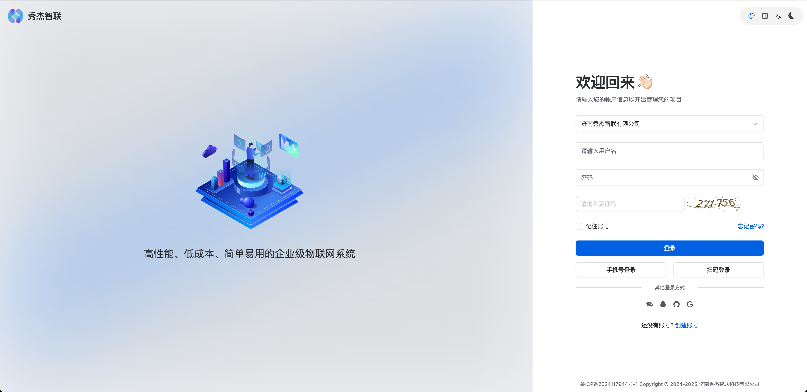

#### 产品列表
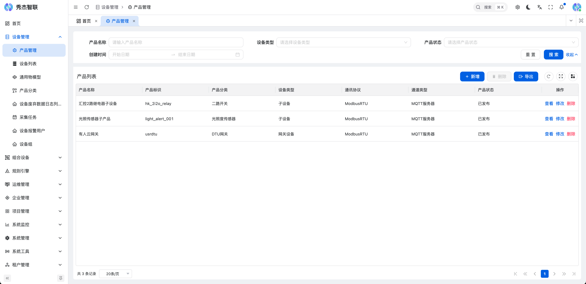

#### 产品列表采集任务
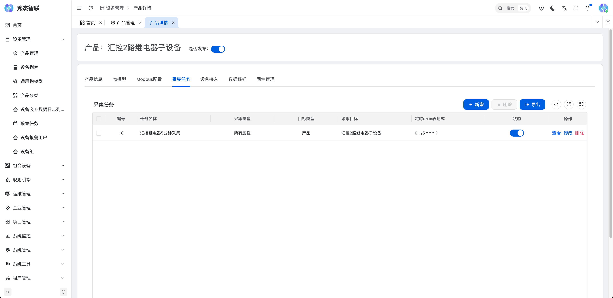

#### 产品物模型配置
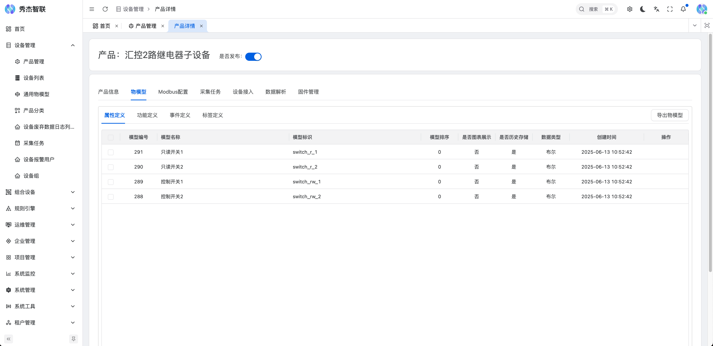

#### 产品列表Modbus配置
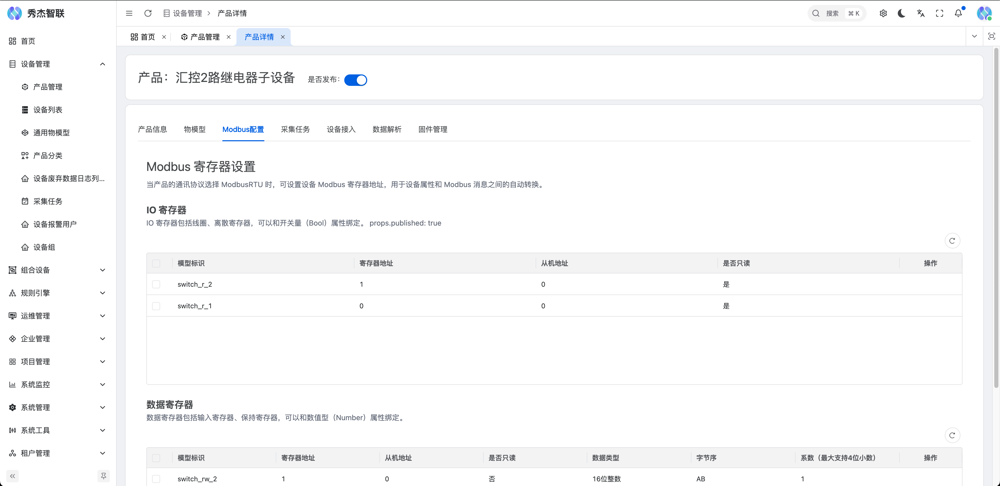

#### 设备列表
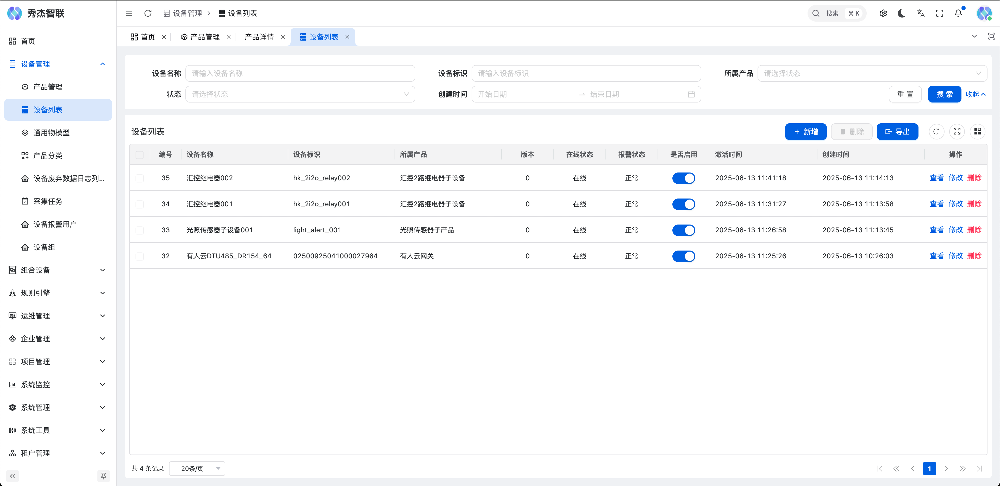

#### 设备详细设备属性列表
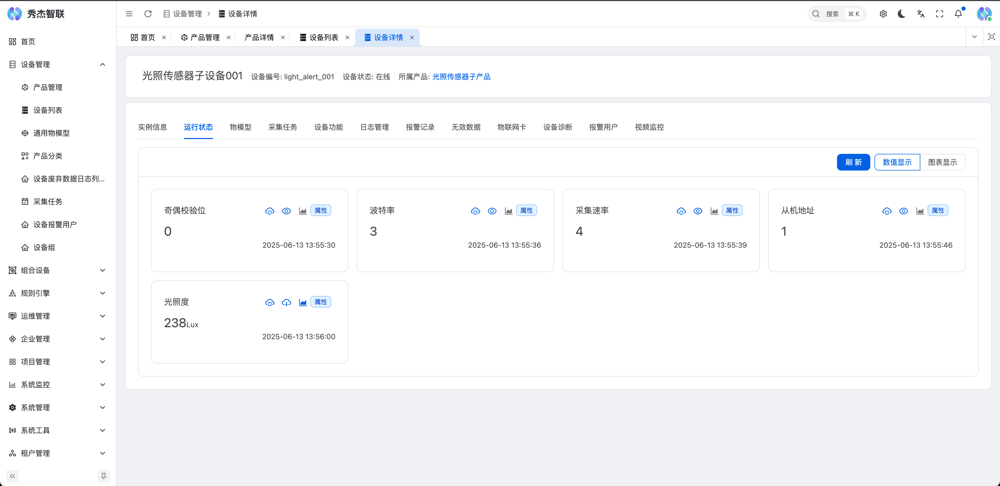

#### 设备详情属性趋势图
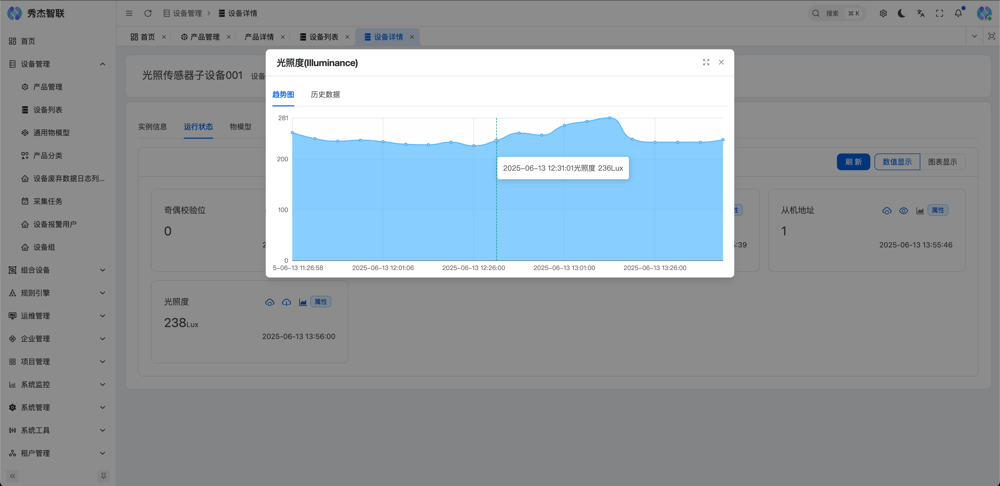

#### 设备详情属性历史数据
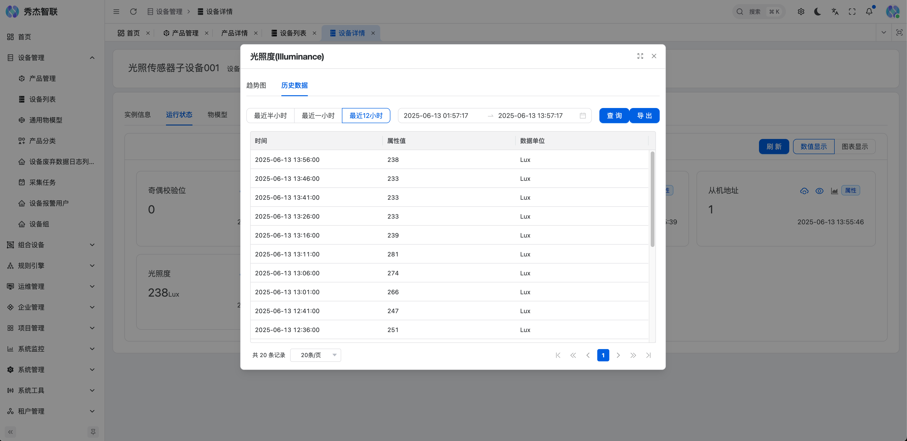

#### 设备消息日志
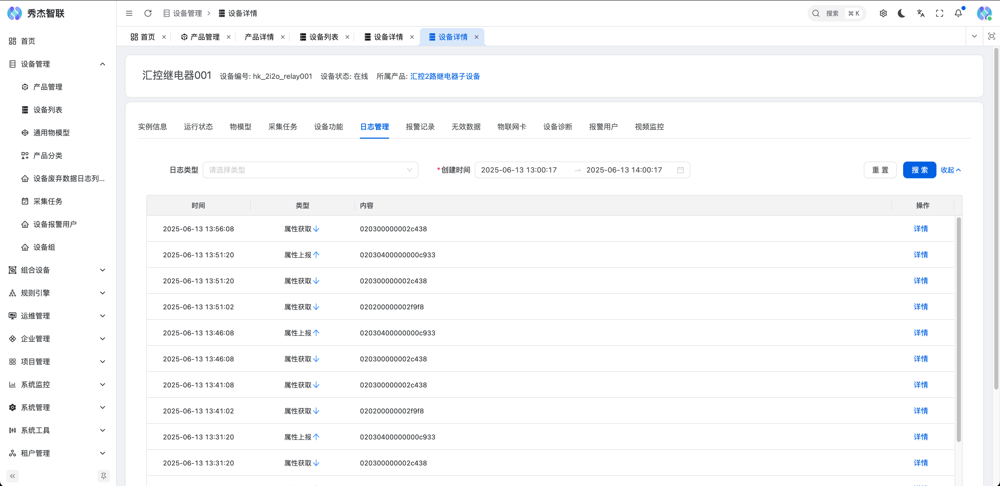

#### 设备消息日志详情
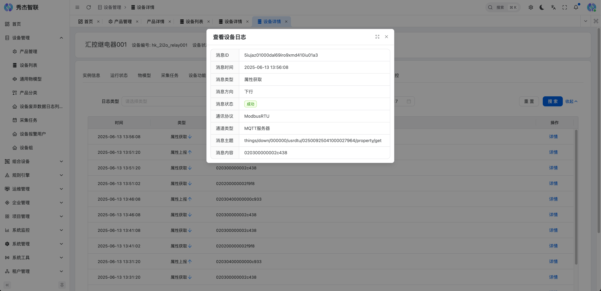

#### 场景联动
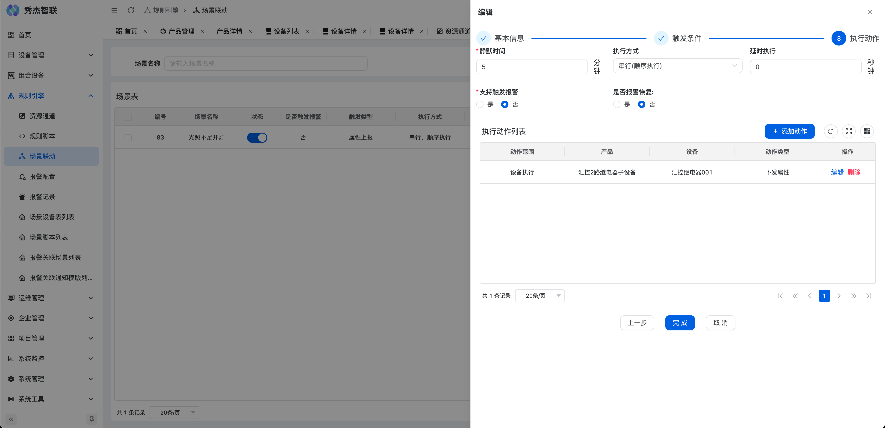

#### 规则脚本
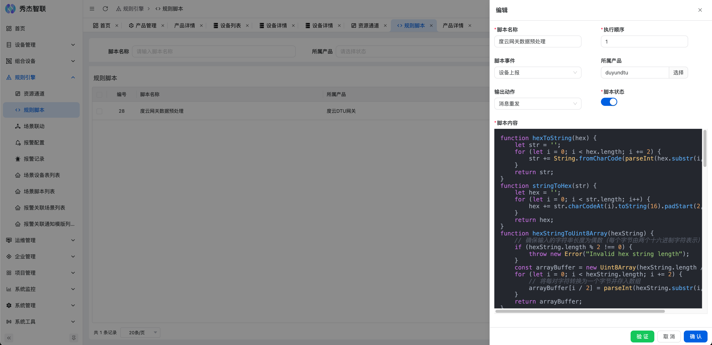

#### 资源通道配置
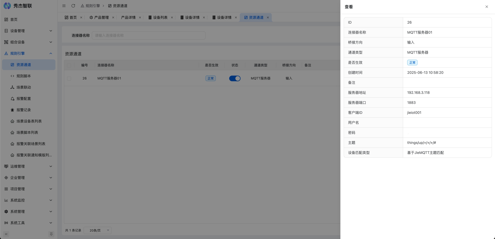

